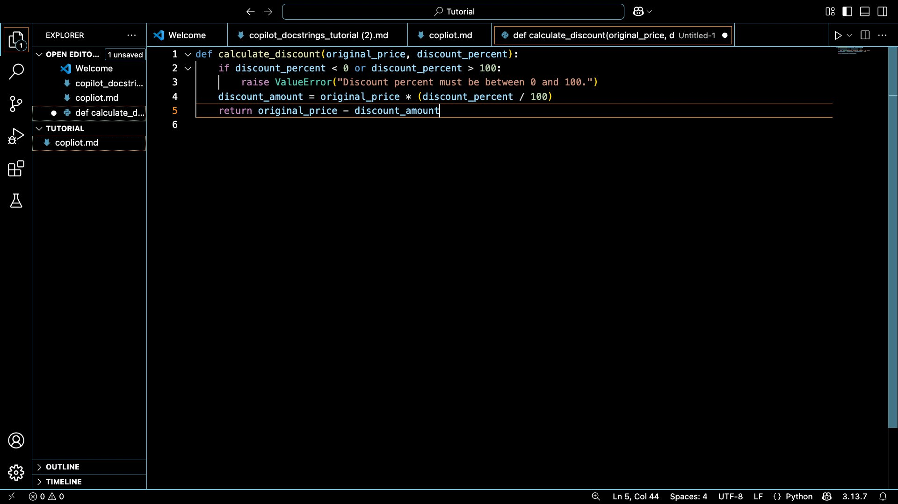
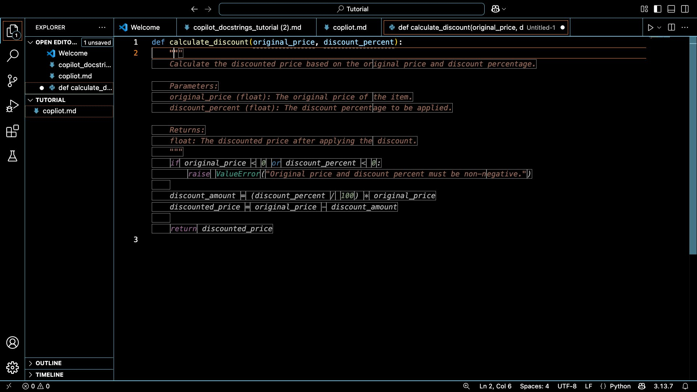
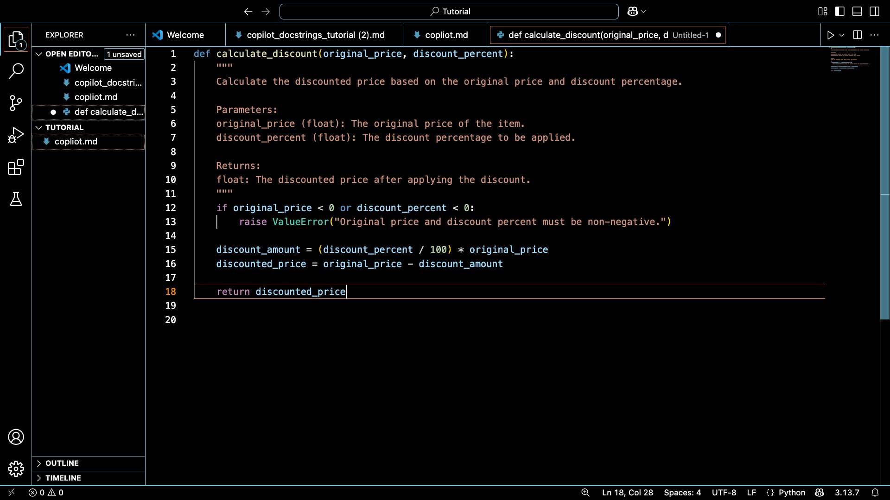

# Tired of Writing Docstrings? GitHub Copilot Has You Covered

Let's be honest, writing docstrings is the part of coding that most developers silently skip. You've just wrestled your function into working correctly, and now you're supposed to *also* explain it in plain English? Every single time?

GitHub Copilot changes that equation. In this tutorial, you'll learn how to use it to generate Python docstrings almost automatically, where it genuinely shines, and where you'll still need to step in yourself.

---

## What Exactly Is GitHub Copilot?

GitHub Copilot is an AI-powered coding assistant that lives right inside your editor: VS Code, PyCharm, and others. As you write code, it reads your file's context and suggests completions: next lines, whole functions, and yes, full docstrings.

Because it's been trained on a massive amount of public code, it has absorbed patterns from thousands of well-documented Python projects. That's what makes it so good at describing what your code does —, often better than a rushed developer on a deadline.

---

## Seeing It in Action

Here's where we start, a freshly written function with no documentation at all:

```python
def calculate_discount(original_price, discount_percent):
    if discount_percent < 0 or discount_percent > 100:
        raise ValueError("Discount percent must be between 0 and 100.")
    discount_amount = original_price * (discount_percent / 100)
    return original_price - discount_amount
```


*Step 1 — A working function, but no documentation yet.*

Now, place your cursor right after the `def` line and type `"""`. Copilot reads the entire function body and suggests a full docstring in grey italic text:


*Step 2 — Copilot suggests the entire docstring automatically after you type `"""`.*

It caught the parameters, the return type, and the `ValueError`, without you typing a single word of documentation. Press **Tab ⇥** to accept, and here's what you get:


*Step 3 — Press Tab and the docstring is inserted into your function instantly.*

The final result looks like this:

```python
def calculate_discount(original_price, discount_percent):
    """
    Calculate the discounted price based on the original price and discount percentage.

    Parameters:
        original_price (float): The original price of the item.
        discount_percent (float): The discount percentage to be applied.

    Returns:
        float: The discounted price after applying the discount.
    """
    if discount_percent < 0 or discount_percent > 100:
        raise ValueError("Discount percent must be between 0 and 100.")
    discount_amount = original_price * (discount_percent / 100)
    return original_price - discount_amount
```

---

## Why This Actually Makes You a Better Developer

Here's the thing, it's not just about saving time. It's about *when* you document.

Copilot nudges you to write documentation the moment you finish a function, while the logic is still fresh. Compare that to the classic alternative: circling back three weeks later to document functions you barely remember writing.

There's a consistency bonus too. If your file already uses Google style or NumPy style docstrings, Copilot picks up on that pattern and keeps everything uniform — no manual style-checking needed.

---

## Where Copilot Can't Help You

Copilot reads your code, not your mind. A few situations where you'll need to take over:

- **Hidden business rules.** If a parameter has constraints tied to an external system or a business requirement, Copilot has no way to know that. You'll need to document those yourself.

- **Poorly named functions.** Copilot documents what the name suggests, not what the function actually does. If `process_data()` actually sends an email, the docstring will be wrong.

- **Complicated return types.** Nested dicts, custom objects, or context-dependent outputs often get vague or incomplete descriptions.

Think of every Copilot suggestion as a first draft that needs a 10-second review, not a final answer.

---

## Should You Add It to Your Workflow?

If you write Python regularly and documentation feels like the most draining part, Copilot's docstring generation is worth a try. Setup takes minutes — install the GitHub Copilot extension in VS Code and you're ready to go.

It won't be right 100% of the time. But it will produce solid, structured documentation most of the time, which puts you ahead of the majority of codebases out there.

---

*Have a workflow tip for using Copilot with docstrings? Drop it in the comments below.*
